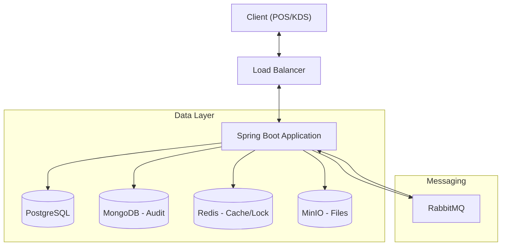

# 🥤 Beverage POS & KDS System (多租戶飲料店點餐與廚房顯示系統)

這是一個專為手搖飲料店設計的企業級 **多租戶 (Multi-Tenant) POS 系統**。
專案採用前後端分離架構，後端基於 Spring Boot 實作 **模組化單體 (Modular Monolith)**，前端使用原生 JavaScript (Vite)。

系統整合了複雜的商品客製化（甜度冰塊）、會員點數機制、即時廚房顯示系統 (KDS)，並採用 **多語言持久化 (Polyglot Persistence)** 架構以應對高併發與大數據量的審計需求。

---

## 🚀 專案亮點與核心功能

### 1. 核心業務 (Core Business)
* **多租戶架構**：單一系統支援多個品牌 (Brand)，資料透過 `BrandContextHolder` 與 JWT 自動隔離。
* **高度客製化商品**：透過 `OptionGroup` 與 `ProductOption` 實現複雜的飲料客製化（如：半糖、少冰、加椰果）。
* **狀態模式訂單管理**：使用 **State Pattern** 管理訂單生命週期 (`PENDING` -> `PREPARING` -> `READY` -> `CLOSED`)，確保業務流轉嚴謹。
* **混合式庫存架構 (Hybrid DAO)**：
    * **讀取**：使用 JPA 處理複雜關聯。
    * **寫入**：使用 **JDBC Batch Update** 處理高併發庫存扣減 (FIFO)，大幅降低資料庫鎖定時間。

### 2. 智慧庫存與耗損管理 (Smart Inventory & Waste Analysis)
* **週期性盤點架構 (Periodic Review)**：
    * 放棄傳統的銷售即扣庫存模式，改採 **「手動盤點 (Audit) + 快照 (Snapshot)」** 機制，更符合餐飲業實務。
    * 支援 **批次盤點 API**，自動計算差異並寫入稽核日誌。
* **配方倒扣與耗損分析 (BOM & Variance Report)**：
    * 建立 `Recipe` (配方表)，定義飲品規格與原物料的關聯。
    * **耗損報表**：自動計算「理論消耗量」與「實際盤點消耗量」的差異，精準抓出原料浪費與異常耗損。
* **進貨履歷與食安追溯**：保留 `InventoryBatch` 作為進貨履歷，支援食安效期追溯。

### 3. 即時互動與非同步 (Real-time & Async)
* **WebSocket & SSE 雙重推播**：
    * **KDS 端**：透過 SSE 即時接收訂單變更。
    * **消費者端**：透過 WebSocket (STOMP) 接收個人訂單狀態通知。
* **非同步訂單處理**：整合 RabbitMQ 實現線上訂單削峰填谷，解耦 API 響應與訂單寫入邏輯。
* **非同步審計日誌**：使用 AOP 攔截關鍵操作並非同步寫入 MongoDB。

### 4. 可靠性與效能 (Reliability & Performance)
* **分散式鎖**：使用 **ShedLock** 確保排程任務 (如日結報表) 在叢集環境中單一執行。
* **資料一致性**：庫存扣減採用 `PESSIMISTIC_WRITE` 悲觀鎖，經 **K6** 壓力測試驗證，在高併發搶購場景下無超賣。
* **檔案分片上傳**：整合 **MinIO** 物件儲存，支援大檔案分片上傳與斷點續傳。

---


## 🖥️ 系統介面與功能模組 (Frontend Pages)

### 本專案提供全方位的前端操作介面，涵蓋從點餐到後台管理的全流程：
* **登入系統(`login.html`)**：
  * 支援品牌員工登入。
* **POS 點餐收銀(`pos.html`)**：
  * 商品分類瀏覽與高度客製化選項（甜度、冰塊、加料）選擇。
  * 即時購物車管理與金額計算。
* **結帳與支付 (`checkout.html`)**：
  * 支援會員點數抵扣。
* **KDS 廚房顯示系統(`kds.html`)**：
  * 即時接收新訂單通知（透過 SSE）。
  * 視覺化訂單卡片管理，支援狀態一鍵切換（製作中、待取餐）。
* **智慧庫存盤點 (`inventory_audit.html`)**：
  * 進貨與盤盈虧管理：整合批次進貨（含效期記錄）與盤點差異分析。
* **營運報表看板 (`report.html`)**：
  * 整合 ECharts，提供營收統計、熱門商品及庫存損耗分析圖表。


---

## 🛠️ 技術棧 (Tech Stack)

### Backend (後端)
* **Language**: Java 21
* **Framework**: Spring Boot 3.x
* **Databases (Polyglot Persistence)**:
    * **PostgreSQL**: 核心關聯資料 (關聯查詢強)
    * **MongoDB**: 審計日誌 (Audit Log) (寫入吞吐量高、結構鬆散)
    * **Redis**: 快取、Session、分散式鎖、訂單流水號生成
* **Message Queue**: RabbitMQ (Fanout Exchange 廣播模式)
* **Object Storage**: MinIO (S3 Compatible)
* **Security**: Spring Security + JWT (雙層認證：平台管理員 vs 租戶員工)
* **Testing**: JUnit 5, Mockito, **Testcontainers**, **K6** (Load Testing)

### Frontend (前端)
* **Build Tool**: Vite
* **Core**: Vanilla JavaScript (ES Modules)
* **UI Components**: Google Material Web Components (MWC)
* **Charts**: Apache ECharts (報表視覺化)

---

## 📂 系統架構圖 (簡易)



## 🚀 快速開始 (Quick Start)
### 前置需求
* Docker & Docker Compose

* Java 21 (若要本機執行)

### 啟動步驟
1. **啟動基礎設施 (資料庫、訊息佇列、儲存服務)**：

```bash
docker-compose up -d
```


2. **啟動後端應用**：
```bash
./mvnw spring-boot:run
```
*系統啟動時，DataSeeder 會自動初始化測試用的品牌、分店、商品與庫存資料。*

3. **啟動前端** ：
```bash
cd frontend
npm install
npm run dev
```

### 預設測試帳號

* **品牌管理員**: `0911111111` / `password123`

* **平台超級管理員**: `admin` / `admin123`

## 🧪 測試與驗證

### 執行單元與整合測試
本專案使用 **Testcontainers** 啟動真實的 DB 環境進行測試：
```bash
./mvnw verify
```

### 執行 K6 壓力測試

驗證庫存併發扣減的正確性：
```bash
k6 run tests/k6/scenarios/inventory_stress.js
```

---

## 📝 開發藍圖 (Roadmap)

詳細開發進度請參閱 `BLUEPRINT_2025_UPGRADE.md`。

- [x] Phase 1: 核心重構 (Facade, TSID, Hybrid DAO)

- [x] Phase 2: 業務擴充 (促銷引擎, RBAC)

- [x] Phase 3: 非同步與效能 (RabbitMQ, MinIO, MongoDB Audit, K6)

- [X] Phase 4: 即時互動 (WebSocket 線上揪團)

- [ ] Phase 5: 微服務拆分